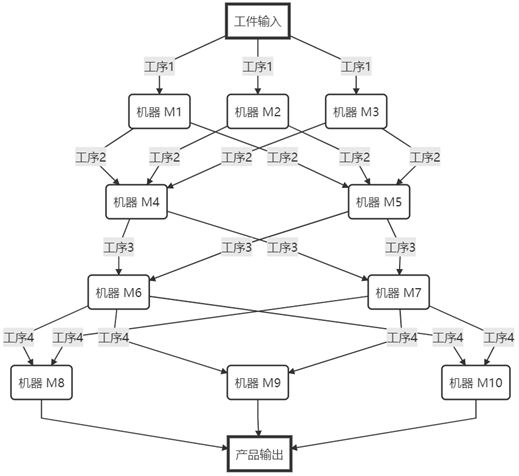
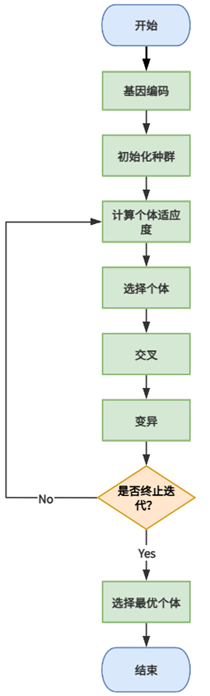
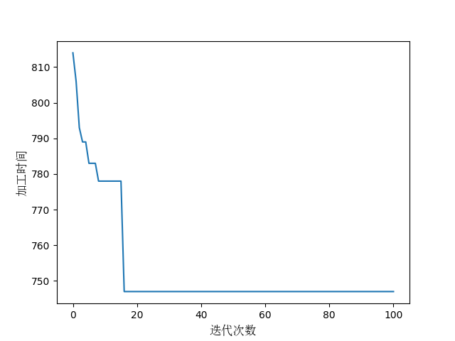
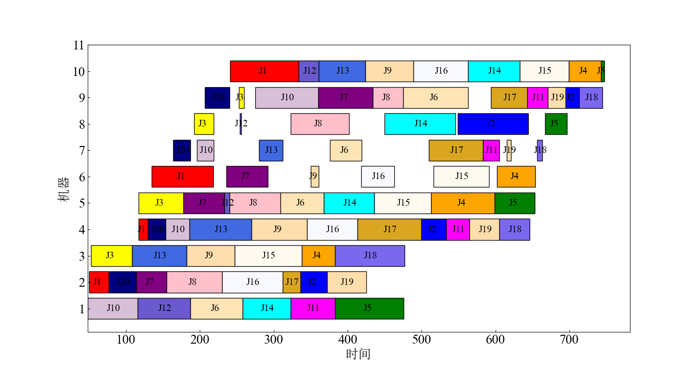
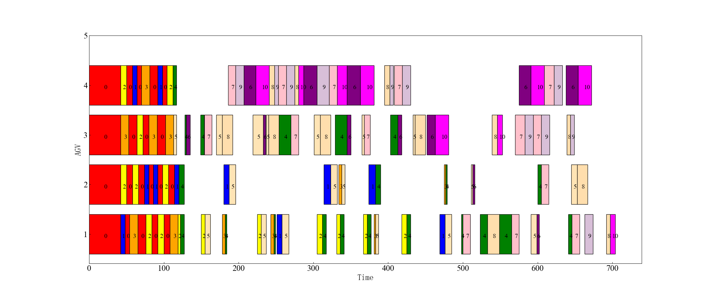

## HFSP-and-AGV-scheduling-based-on-genetic-algorithm

#### 1、HFSP

The Hybrid Flow Shop Scheduling Problem (HFSP) is a significant optimization issue in the field of production scheduling. It integrates the characteristics of the classic flow shop and parallel machine scheduling, aligning more closely with actual production requirements and possessing high research value and practical application background. The HFSP involves scheduling a set of jobs in a workshop that includes multiple processing stages. Each stage may contain one or more parallel machines, and jobs need to go through each stage in a certain process order for processing. The goal is to find the best processing sequence and machine allocation plan to optimize specific performance indicators, such as minimizing the total completion time or the maximum completion time.

The HFSP can be categorized based on the type of parallel machines:

- Parallel identical machines: The processing time on each machine at each stage is the same.
- Parallel non-identical machines: The parallel machines at each stage have the same function but different processing speeds, leading to different processing times.
- Unrelated parallel machines: The machines at each stage have different functions and, consequently, different processing times.

Solving algorithms for HFSP include:

- Exact algorithms: Such as integer programming, suitable for small-scale problems.
- Heuristic algorithms: Rule-based methods, like the shortest processing time first.
- Metaheuristic algorithms: Such as genetic algorithms, simulated annealing, particle swarm optimization, etc., suitable for large-scale problems.
- Learning algorithms: Utilizing historical data and machine learning techniques to guide the search process.

The HFSP is also a typical NP-hard problem, and finding the optimal solution is computationally complex. Therefore, researchers and practitioners often seek heuristic solutions or use learning algorithms to find exact solutions, in order to obtain satisfactory scheduling plans with reasonable resource allocation.

#### 2、GA

Genetic Algorithm (GA) is a search heuristic algorithm that simulates the process of biological evolution. It was proposed by John Holland in the early 1970s, inspired by Darwin's theory of natural selection and genetics. Genetic algorithms are commonly used to solve optimization and search problems, especially when the search space of the problem is very large or the problem itself is difficult to solve using traditional methods. The general steps are: encoding, initial population, fitness calculation, selection and elimination, crossover, and mutation. Its application in Flow Shop Scheduling Problem (FSP) [63] and Hybrid Flow Shop Scheduling Problem (HFSP) [64] can achieve good performance.

The basic process of traditional genetic algorithms can be summarized in the following main steps:

1. **Encoding**: Convert the possible solutions of the problem into the genotype form of chromosomes (or individuals), which form the basis of genetic algorithm operations;
2. **Initialization of Population**: Randomly generate an initial population that contains the diversity of potential solutions to the problem;
3. **Fitness Assessment**: Calculate the fitness value for each individual in the population to evaluate its ability to solve the problem;
4. **Selection Operation**: Based on the fitness values of individuals, use specific selection strategies to select excellent individuals as parents;
5. **Crossover Operation**: With a certain probability, swap parts of the genes of the selected parent individuals to produce new offspring;
6. **Mutation Operation**: With a certain probability, change some gene positions of the offspring individuals to further increase the diversity of the population;
7. **Termination Condition Judgment**: Check if the preset termination conditions are met, such as reaching the maximum number of iterations or the quality of the solution reaching a predetermined standard;
8. **Iteration**: If the termination conditions are not met, the algorithm returns to the selection operation step and continues to iterate; if met, the algorithm terminates;
9. **Output Results**: At the end of the algorithm, output the currently found optimal solution as the global optimal solution of the problem. This process simulates natural selection and genetic mechanisms, continuously iterating and optimizing, gradually guiding the population to evolve towards better solutions.

The iterative process of genetic algorithms aims to gradually improve the overall fitness of the population, ultimately finding the optimal or near-optimal solution to the problem. Below is the flowchart:

#### 3、RESULT

